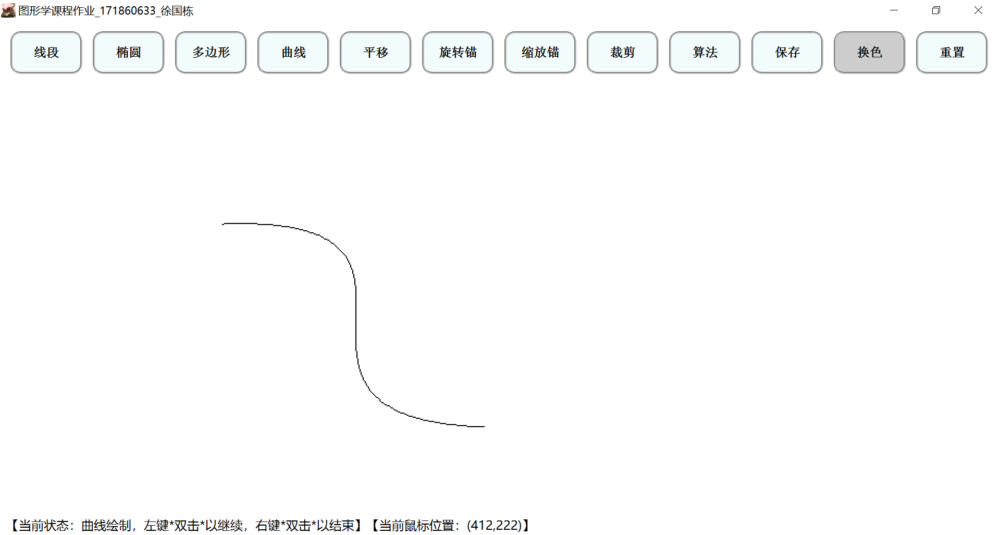
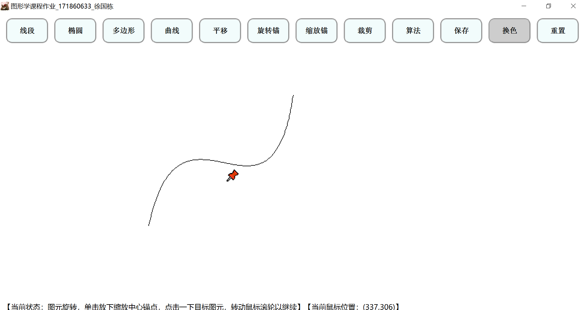
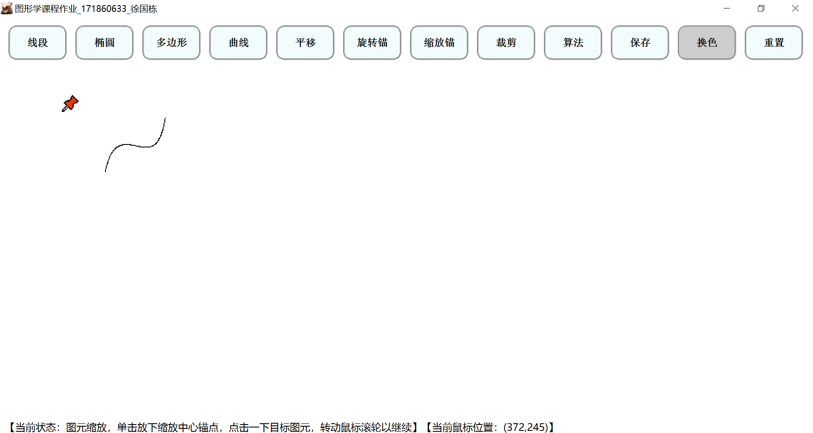
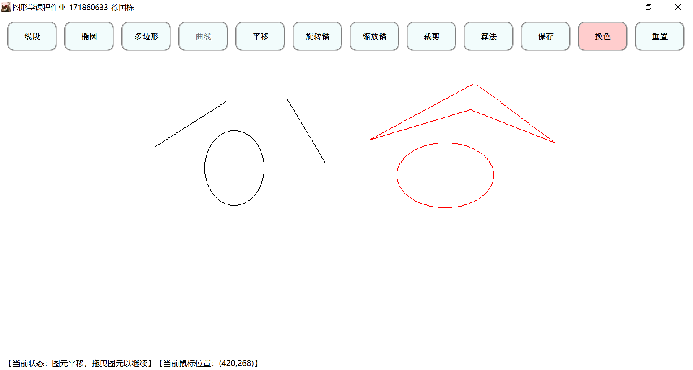
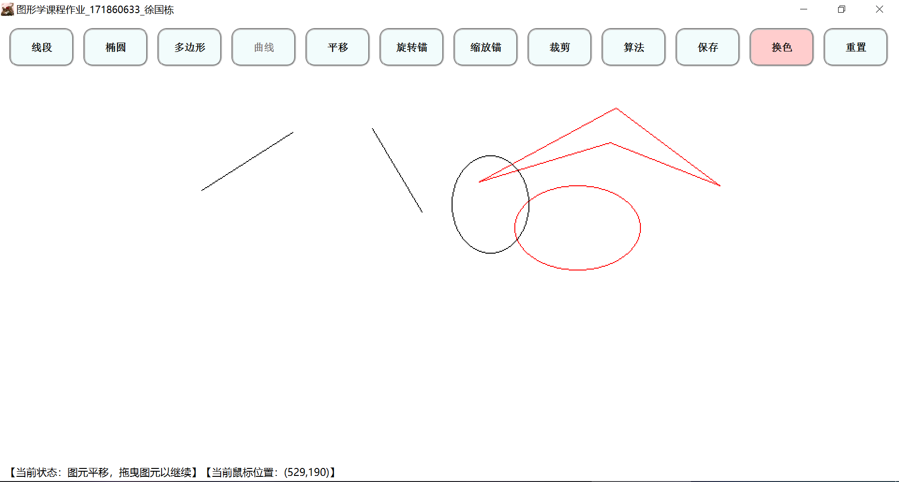
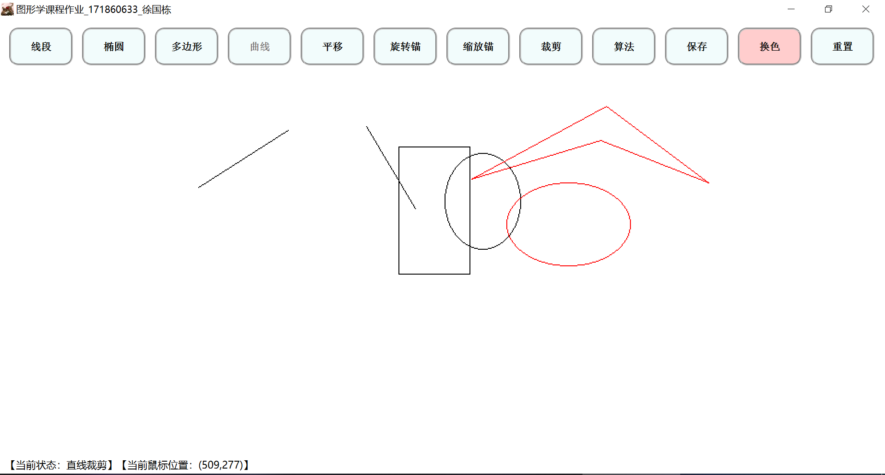
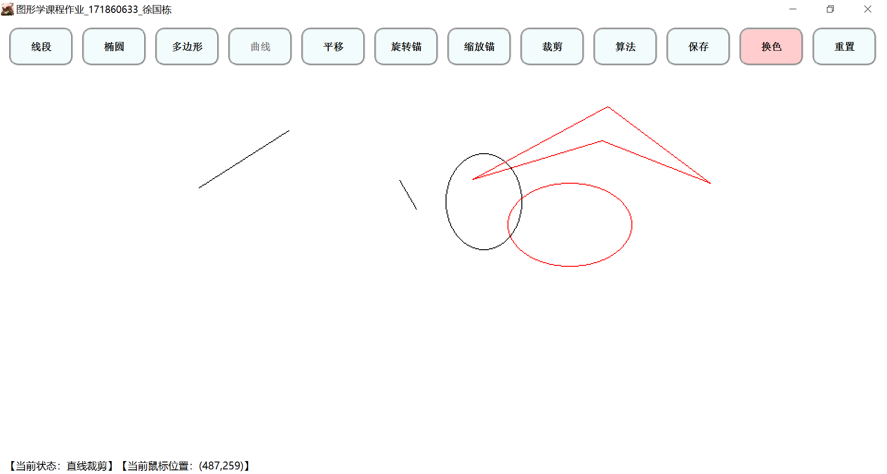
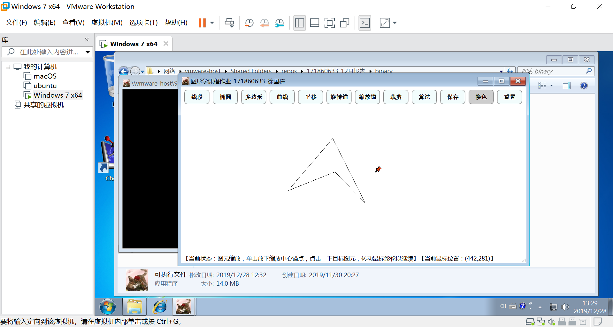

# 图形学课程作业 编译和系统使用说明书

## 171860633 徐国栋

## 开发环境

VS2019, Qt_5.12.6_MSVC2017

## 打包环境

qt creator, Qt_5.14.0_src_static_build

## 编译说明

### 源码配置说明

1. 源码使用GBK编码，编译前请调整你的IDE前端为GBK编码
2. 对于 qt creator，设置 工具-选项-文本编辑器-行为-文件编码 为GBK，在非windows平台编译的时候，注释掉pro文件中的 RC_FILE += 171860633_CG2019.rc
3. 对于 vs2015/2017/2019，无需修改默认配置，新建vs-qt工程，添加源码文件即可

### qtcreator 动态编译

1. 使用 qtcreator>=4.10.2，双击打开source/171860633_CG2019.pro，设置编译套件

2. 注释掉source/src/main.cpp里面的
```c++
#include <QtCore/QtPlugin>
Q_IMPORT_PLUGIN(QWindowsIntegrationPlugin)
```

3. 编译运行

### 静态编译

1. 恢复source/src/main.cpp里面的
```c++
#include <QtCore/QtPlugin>
Q_IMPORT_PLUGIN(QWindowsIntegrationPlugin)
```

2. 针对vs2015/2017/2019，需要手动添加静态库，在source/src/main.cpp里有静态编译需要的所有链接库名称的注释

## GUI界面

曲线原图-基于锚点的曲线旋转-基于锚点的曲线缩放





图元选中-鼠标拖曳




线段裁剪框-线段裁剪





## 功能介绍和操作手册

### 对于文件接口，在binary目录下运行
```
可执行文件.exe input.txt
```

### 对于用户交互接口，使用说明如下： 

#### 程序启动

* 双击【binary/可执行文件.exe】

#### 重置画布

* 点击重置按钮，画面置为全白

#### 设置颜色

* 点击换色按钮，在调色板选中画笔颜色，点击确认完成画笔颜色修改

#### 保存画布

* 点击保存按钮，弹出文件对话框，输入文件名，保存bmp格式的图片到可执行文件目录下

#### 画直线、椭圆

* 点击对应按钮。通过鼠标左键单击按下，确定起点，移动鼠标，松开左键，结束，确定终点

#### 画多边形、曲线

* **双击**鼠标左键确定一个控制点，实时渲染，多次双击，确定多个控制点; \
**双击**鼠标右键确定最后一个点，固定渲染

#### 算法切换

* 点击算法按钮，弹出算法选择面板，选择后台算法。注意：选择的算法仅当次操作有效，之后恢复默认算法

#### 线段裁剪

* 点击裁剪按钮，通过鼠标左键单击按下，确定起点，移动鼠标，松开左键，结束，确定终点，\
如果有线段跨越起点终点构成的矩形框，只有框内的线段会被保留

#### 图元平移

* 点击平移按钮，所有图元的最小包含矩形框形成可点击区域，选中图元，拖曳即可

#### 图元旋转

* 点击旋转按钮，单击放下旋转中心锚点，点击一下目标图元，转动鼠标滚轮以继续， \
你可以重复进行点击图元-转动滚轮的操作

#### 图元缩放

* 点击缩放按钮，单击放下缩放中心锚点，点击一下目标图元，转动鼠标滚轮以继续， \
你可以重复进行点击图元-转动滚轮的操作

#### 提示

* 你可以从程序界面下方的边框里看到操作提示

### 动画演示

* 你可以观看 【picture/包含可视化锚点的演示.mp4】 中关于如何使用锚点等功能的演示

### 可执行文件的兼容性


