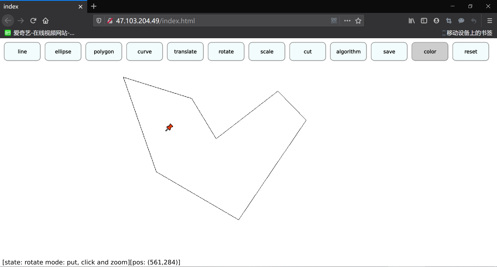

# NJU-Graphics-Homework-2019

## 南京大学 2019年计算机图形学课程 CG2019 大作业

### 支持图元拖曳、定点滚轮旋转和缩放 基于Qt 不涉及opengl

[编译和使用手册.md，点击查看](./171860633_系统使用说明书.md)

### 试用 Emscripten, Qt-5.14.1

* 10M左右的WASM传输，薛定谔秒的加载，刷新之前，这网页是传还是没传过来呢？桌面端firefox(√)、Edge(√)、chrome(√)，移动端MIUI自带浏览器(×)

[测试链接](http://Xuguodong1999.github.io/CG2019.html)

* 测试链接中，内容由一个后台node进程分发，没有重启机制，让我们祝愿这个进程活到服务器到期(×)

* 备注：没有对图元编辑功能进行抽象
* 备注：没有使用树状结构进行图元管理
